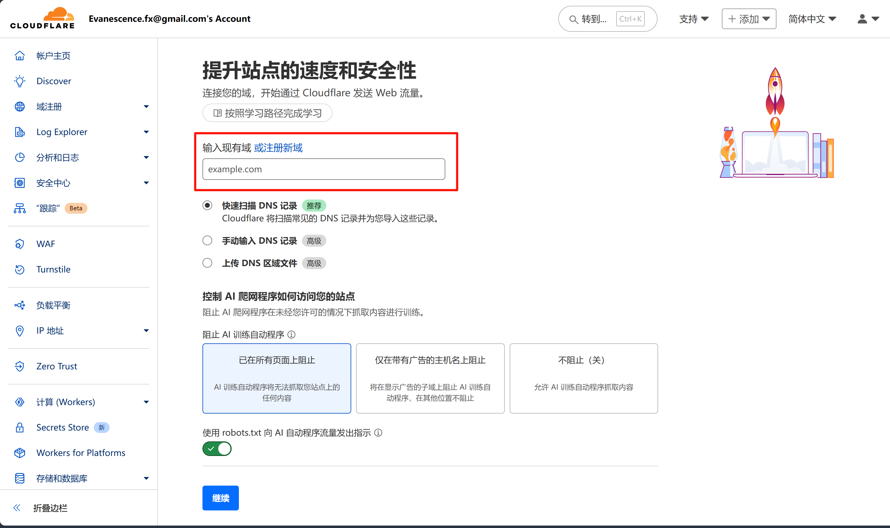
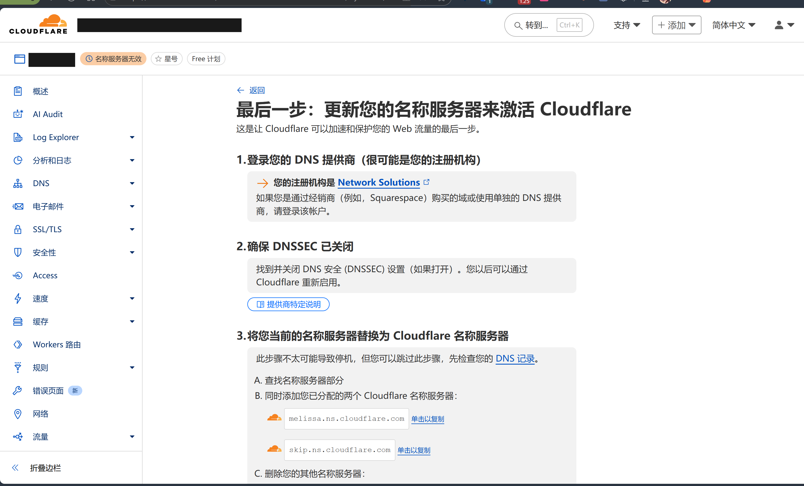

> 最近用Github Education白嫖了name.com的一个一年域名，一开始我按照vercel官方文档部署，发现国内无法直连。故在网上搜索一番，发现可以通过Cloudfare来解决这个问题。但网上的教程大多比较老旧。经过一番摸索，终于成功解决了这个问题。下面就分享一下我的解决方案。

## 第一步：将你的域名添加到 Cloudflare

1. 登录你的 Cloudflare 账户。
2. 点击 **Add a site** 按钮，输入你的根域名（如 `your-domain.com`），然后点击 **Add site**。
3. 
4. 选择 **Free（免费）** 套餐，点击 **Continue**。
5. Cloudflare 会自动扫描你域名现有的 DNS 记录，等待扫描完成后点击 **Continue**。

## 第二步：修改域名的 Nameservers (NS 记录)

这是最关键的一步，目的是将你域名的解析管理权正式交给 Cloudflare。

1. Cloudflare 会显示你域名当前的 Nameservers，并提供两个新的 Cloudflare Nameservers，例如：  
   `melissa.ns.cloudflare.com` 和 `skip.ns.cloudflare.com`
   
2. 登录你购买域名的平台（如 GoDaddy、NameSilo、阿里云/万网），这里以 name.com 为例。
3. 找到你域名的 DNS 管理或 Nameserver 管理设置。
4. 删除原有的 Nameserver 地址，填入 Cloudflare 提供的两个新地址。
5. 保存更改。此更改全球生效可能需要几分钟到数小时。你可以回到 Cloudflare 页面，点击 **Done, check nameservers** 让 Cloudflare 定期检查。生效后 Cloudflare 会邮件通知你。

## 第三步：在 Cloudflare 中配置 DNS 记录（并开启代理）

在等待 NS 记录生效的同时，可以先配置好 DNS 记录：

1. 在 Cloudflare 网站左侧菜单选择 **DNS**。
2. 根据 Vercel 要求，添加一条 **A 记录** 或 **CNAME 记录** 指向 Vercel：

   **推荐：A 记录（用于根域名）**

   ```
   Type: A
   Name: @ （代表你的根域名 your-domain.com）
   IPv4 address: 76.76.21.21
   Proxy status: 确保云朵图标是橙色的（Proxied），表示流量会经过 Cloudflare 的 CDN。
   ```

   点击 **Save**。

   **如果你想用 www 子域名（如 www.your-domain.com ）：**

   - Type: CNAME
   - Name: www
   - Target: cname.vercel-dns.com
   - Proxy status: 确保云朵图标是橙色的（Proxied）。

   点击 **Save**。

## 第四步：配置 SSL/TLS 加密模式（非常重要）

这一步配置错误会导致网站无法访问或出现重定向循环。

1. 在 Cloudflare 网站左侧菜单选择 **SSL/TLS**。
2. 在 **Overview** 选项卡中，选择 **Full (Strict)** 模式。

> **为什么？**  
> Vercel 会自动为你的自定义域名部署 SSL 证书，实现 HTTPS 加密。Full (Strict) 模式要求从用户浏览器到 Cloudflare，以及从 Cloudflare 到 Vercel 源服务器的全程都使用严格的、受信任的证书进行加密，这是最安全且与 Vercel 兼容性最好的模式。

## 第五步：在 Vercel 中添加你的自定义域名

1. 回到你的 Vercel 项目控制台。
2. 进入项目的 **Settings → Domains**。
3. 输入你的自定义域名（如 your-domain.com 或 www.your-domain.com ），点击 **Add**。
4. 由于你已在 Cloudflare 配置好 DNS，Vercel 应能很快检测到并显示 **Valid Configuration**，并自动处理 SSL 证书签发。

---

完成以上所有步骤后，等待几分钟，你的网站应该就可以通过自定义域名在国内顺畅访问了。