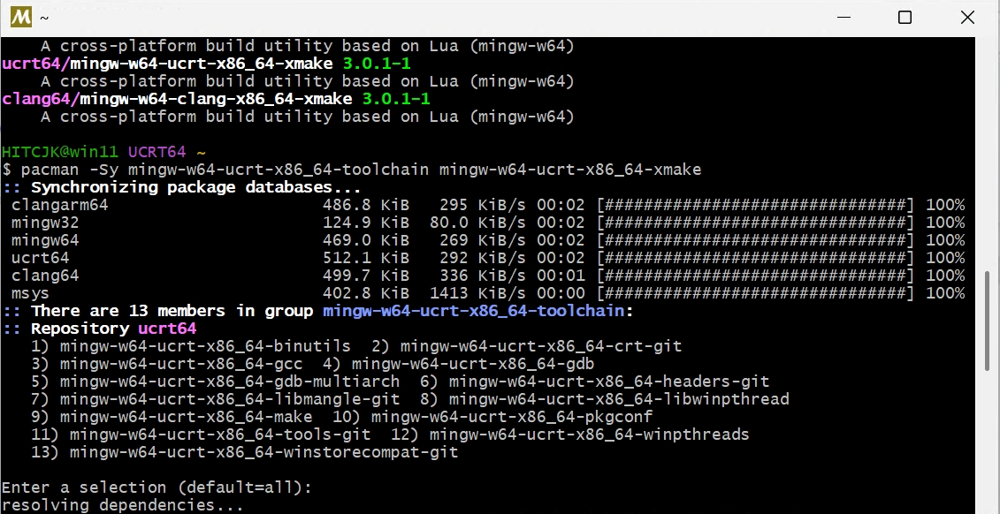

转载自[南工麟云程序组新队员开发环境搭建指南](https://github.com/HITCJK/doc_for_freshmen/blob/main/msys2.md)，作者：@HITCJK

## MSYS2简介

MSYS2 是一个为Windows提供类Unix环境的开源软件，集成了强大的包管理器pacman，可以方便地安装和管理各种开发工具和库。我们选择 MSYS2 的原因能够轻松安装和更新GCC、xmake等常用开发工具并统一管理，可以免去逐一寻找安装包的麻烦。

## MSYS2安装

MSYS2的官方服务器由于假设在国外，下载较慢。这里建议在校内同学使用我们学校开源技术协会在内网搭建的校内镜像站[HITSZ OSA Mirrors](https://mirrors.osa.moe/)


接下来运行安装包，选择安装位置这一步可以根据自己的喜好更改，但除非是因分盘导致C盘空间紧张，都推荐保持默认安装位置以避免问题。其他选项均保持默认即可。


安装完成后我们可以看到下列图标，这些是MSYS2的6个独立的子环境。


每个子环境会有一个单独的文件夹，和一个专门的命令行界面入口，具体区别见下图。一般来说，直接使用UCRT64就行。


## MSYS2换源

如前文所述，MSYS2的官方服务器在国外，下载较慢。为了避免可能出现的网络问题，我们可以将MSYS2的源更换为国内镜像。

打开MSYS2的UCRT64终端，输入以下命令：

```bash
# 使用清华源
sed -i "s#https\?://mirror.msys2.org/#https://mirrors.tuna.tsinghua.edu.cn/msys2/#g" /etc/pacman.d/mirrorlist*

# 或使用学校内网镜像源
sed -i "s#https\?://mirror.msys2.org/#https://mirrors.osa.moe/msys2/#g" /etc/pacman.d/mirrorlist*
```

>提示：在MSYS2等类unix终端中，鼠标选中为复制，中键（按压滚轮）为粘贴。或右键后选择copy（Ctrl+insert）、paste（Shift+insert）。
同时在各种终端中都可以按上下方向键切换历史命令。

## 安装工具链

首先我们需要更新MSYS2的包数据库和核心系统包，确保我们使用的是最新的软件包。打开UCRT64终端，输入以下命令：

```bash
pacman -Syu
```

安装我们所需的GCC工具链和xmake：

```bash
pacman -Sy mingw-w64-ucrt-x86_64-toolchain mingw-w64-ucrt-x86_64-xmake
```

输入回车，默认安装全部软件包。



按提示输入 `y` 并回车确认安装。


安装完成后，我们可以通过以下命令检查GCC和xmake是否安装成功：

```bash
gcc --version
xmake --version
```

如果显示版本信息，说明安装成功。


## 更新工具

打开UCRT64终端，输入以下命令：

```bash
pacman -Syu
```

更多pacman的使用方法可以参考[MSYS2官方文档](https://www.msys2.org/docs/package-management/)或使用`pacman --help`查看帮助。直接搜索教程亦可。

## 配置环境变量

命令行界面就是科幻电影中常见的那种全是字符的界面，我们通过输入一些命令来执行操作。windows上自带的cmd和powershell就是命令行界面，可以按Win+R输入cmd或powershell来启动它们。  
在命令行界面中，只要输入一个程序的相对路径或者绝对路径，就能够运行那个程序（可以不用写.exe）。  
以powershell启动我们刚刚安装的gcc为例，我们需要输入gcc的绝对路径：

```powershell
C:\msys64\ucrt64\bin\gcc --version
```

但是当我们像在MSYS2的UCRT64终端中一样直接输入gcc --version时，系统会提示找不到该命令。


这是因为在MSYS2环境中，它已经将自己安装软件时存放可执行文件的bin目录添加至环境变量，会在其中寻找gcc，而我们的windows系统并不知道该到哪里寻找。因此包括我们以后安装很多开发环境时都会需要配置环境变量。

Win+S搜索path，选择修改系统环境变量，点开环境变量，然后在用户变量（只对当前用户起效）或者系统变量（对所有用户起效，推荐）中找到path变量，添加`C:\msys64\ucrt64\bin`（ucrt64环境的bin目录）。如果你修改了默认安装目录，记得相应修改路径。设置完成后不要直接关闭，记得点确定，否则更改不会被保存。


完成后重新打开cmd或powershell，输入：

```powershell
gcc --version
xmake --version
```

如果显示版本信息，说明配置成功。

如果出现错误“在此系统上禁止运行脚本”


打开管理员权限的powershell，输入：

```powershell
Set-ExecutionPolicy RemoteSigned
```


运行后问题解决


从上面的问题我们可以发现xmake在`C:\msys64\ucrt64\bin`目录下存放的是脚本，而实际上他的可执行文件在`C:\msys64\ucrt64\share\xmake`下，在命令行界面中可以通过脚本调用到别处的可执行文件，但在VScode中通过插件调用会出错，因此我们还可以为xmake单独添加环境变量`C:\msys64\ucrt64\share\xmake`。
